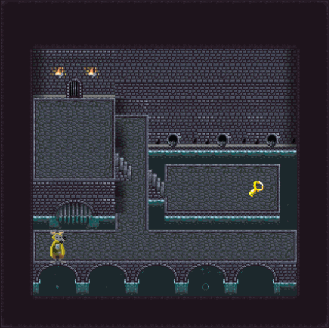

# Wollok Game



## Índice

- [Cómo ejecutarlo](#cómo-ejecutarlo)
- [Cómo está organizado](#cómo-está-organizado)
- [Objetos, clases y responsabilidades](#objetos-clases-y-responsabilidades)
- [Movimiento y colisiones](#movimiento-y-colisiones)
- [Herramientas utilizadas](#herramientas-utilizadas)

## Cómo ejecutarlo

Abrí el proyecto en tu entorno de Wollok y ejecutá el programa `main` de [src/main.wpgm](src/main.wpgm). Este archivo configura el tablero, las colisiones y los visuales, y llama a `game.start()`.

Abrí en el navegador la dirección que indique la consola y mové al héroe con las **flechas del teclado**. Podés consultar estos mecanismos en la [documentación de Wollok Game](https://www.wollok.org/documentation/wollok_game/).

## Cómo está organizado

```text
config/
├── tablero.wlk         # Tablero de 20 × 20, tamaño de celda y fondo
├── paredesHandler.wlk  # Define posiciones y crea las paredes
├── visuales.wlk        # Agrega puerta, llave, héroe y reset al juego
├── colisiones.wlk      # Registra qué hacer cuando colisiona el héroe
└── reset.wlk           # Casillero de finalización y reinicio
src/
├── main.wpgm
├── heroe.wlk
├── llave.wlk
├── puerta.wlk
└── pared.wlk
assets/                # Imágenes del juego, incluido el fondo nivel 1.png
```

## Objetos, clases y responsabilidades

`heroe`, `llave` y `puerta` son **WKOs**: este juego necesita un personaje, una llave y una puerta particulares. No hace falta definir una clase para cada uno.

En cambio, **`Pared` es una clase** porque se necesitan muchas paredes con el mismo comportamiento y distintas posiciones. En `paredesHandler.wlk` se crea cada una con `new Pared(position = posicionPared)`.

Cada objeto tiene una responsabilidad concreta: el héroe recuerda si consiguió la llave; la llave le envía `conseguirLlave()`; la puerta consulta `tieneLaLlave()` y decide si lo deja pasar. `colisiones` conecta estos objetos con los eventos del juego.

La imagen de fondo aporta el dibujo del escenario. Las instancias de `Pared` son objetos invisibles ubicados sobre ese fondo: son ellas las que impiden el paso. El objeto `reset` también es invisible y está detrás de la puerta, en `game.at(4, 15)`.

## Movimiento y colisiones

En `visuales.wlk`, `game.addVisualCharacter(heroe)` registra al personaje controlado por teclado. En `heroe.wlk`, `position(nuevaPosicion)` guarda la posición anterior antes de actualizarla. Así, `retroceder()` puede deshacer el movimiento cuando el héroe encuentra una pared o una puerta sin tener la llave.

## Herramientas utilizadas

Además de Wollok Game, estas herramientas se usaron para preparar los recursos gráficos y mostrar el juego en funcionamiento.

### [LibreSprite](https://libresprite.github.io/)

Editor de pixel art utilizado para:

- Cortar spritesheets (imágenes que reúnen varios sprites).
- Adaptar sprites.
- Trabajar con tiles (piezas que se combinan para formar el escenario).
- Construir el escenario/mapa.

### [OpenGameArt](https://opengameart.org/)

Sitio utilizado para buscar sprites y recursos gráficos gratuitos para el juego.

### [LICEcap (Cockos)](https://www.cockos.com/licecap/)

Herramienta utilizada para grabar y generar el GIF que aparece al comienzo de este README. Es útil para mostrar rápidamente cómo funciona un juego sin tener que grabar y editar un video completo.
